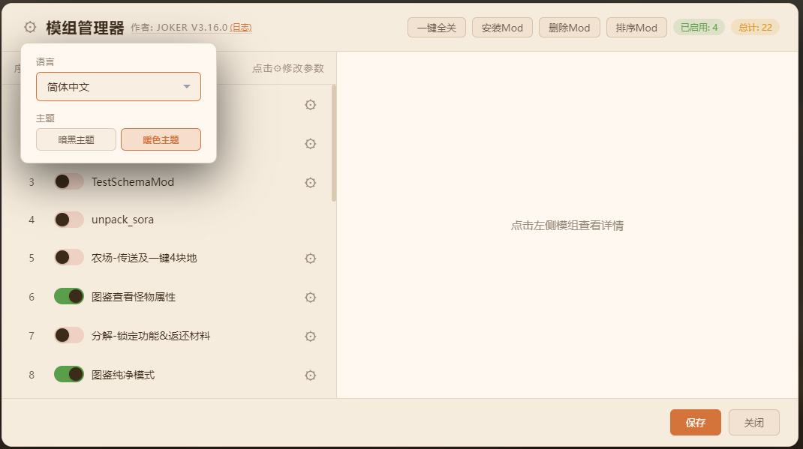
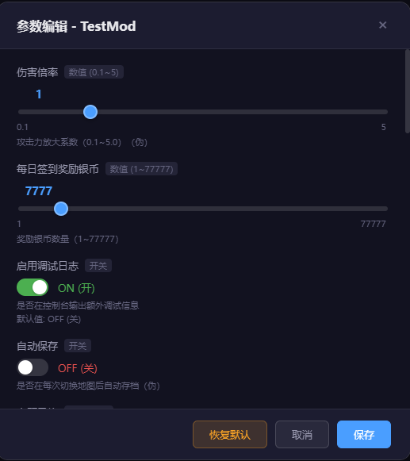
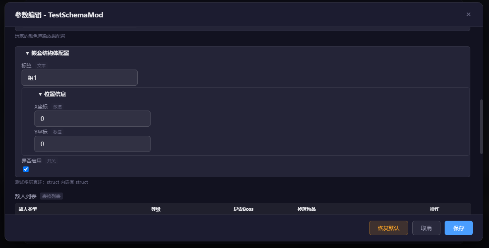
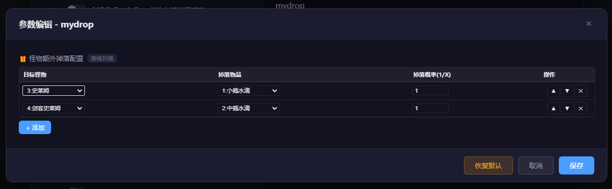
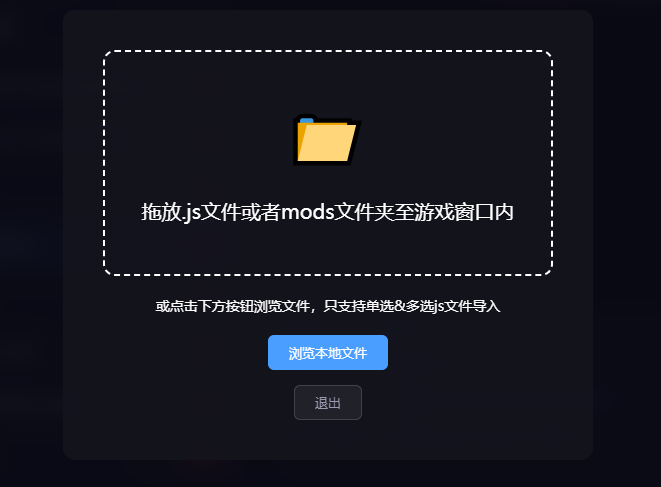
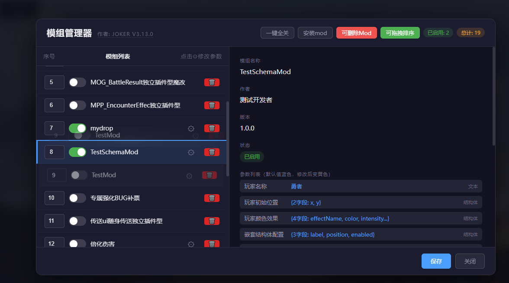

<!-- 本文件由 tools/manager-release/sync.js 从 js/mods/docs/ 自动生成，请勿手改 -->

# RMMZ ModLoader

[](https://github.com/jokerBBC/rpg-maker-mz-mod-loader/blob/main/LICENSE)
[](https://github.com/jokerBBC/rpg-maker-mz-mod-loader/releases/latest)
[](https://github.com/jokerBBC/rpg-maker-mz-mod-loader/releases)

> **[中文版 README](README.md)**

In-game mod manager **V4.3.1**

A powerful RPG Maker MZ mod manager that lets you enable/disable, edit parameters, reorder, and check dependencies for **local mods** and **Steam Workshop mods** — all from inside the game. **Multilingual UI** is supported (Simplified Chinese / Traditional Chinese / English).

> **V4.1.3 prerequisite mods**: **ModDataLoader** (database merge / replace / add, manifest-driven injection) and **ModResourceLoader** (resource replace / add, modId aliases) follow a **ModLoader → prerequisite mod → feature mod** layered design. Game-specific compatibility (encryption, YEP, etc.) is handled via pluggable **GameAdapter** modules so each title can adapt plugins independently. **Partially tested** — see [Developer resources · Prerequisite mods](#prerequisite-mods-v413--partially-tested) below.

> **Runtime environment**: Mod configuration is saved in `mod_config.json` ,
and is **no longer written** to `plugins.js`, so mod toggles and parameters survive official plugin updates.   
> **Steam Workshop** requires a legitimate Steam install path to resolve Workshop directories.  
> **libs extensions**: scripts under `js/mods/libs/` take effect only when they call ModLoader APIs. Piracy detection: ship `piracyGate.js` to enable; delete to disable. Mod store: ship `modStore.js` to enable; delete to disable. Manager self-update: ship `modLoaderUpdater.js` to enable; delete to disable.  

***

## ✨ Real-world examples

- Guide/wiki for the game *Idle Level Up & Fight Monsters* using RMMZ ModLoader V4.1.2 (includes mod manager tutorial · [Feishu link](https://qcnhq5e2tphh.feishu.cn/wiki/XH1jwdX5uil2ookoEF8cpN1AnJf))
- Fine-tuning examples for *Crimson Moon Immortal Journey* based on RMMZ ModLoader V4 ([Baidu Tieba post 1](https://tieba.baidu.com/p/10810499585?fr=personpage) · [Baidu Tieba post 2](https://tieba.baidu.com/p/10813947286?fr=personpage))

***

## ✨ Features

| Feature | Description |
| --- | --- |
| 🎮 **In-game management** | Manage mod toggles, parameters, and load order without external tools |
| 🛒 **Steam Workshop** | Scans `workshop/content/<AppID>/` (AppID configurable); filter, refresh list; unified package layout for local and Workshop mods |
| 🏪 **Mod store extension** | `libs/modStore.js`: multi-source HTTPS catalog subscribe, download/update packages to `_localmods`, resume for large files (>50MB); **multilingual UI** (Simplified / Traditional Chinese, English — follows manager language); list **Changelog** button |
| 🔄 **Manager self-update** | `libs/modLoaderUpdater.js`: manual check/update for ModLoader itself (catalog + raw files); separate from Mod store; disable toggle; green badge additive |
| 📦 **Unified package layout** | Local `_localmods/<package>/` matches Workshop subscription root layout (V4.1); package-root `CHANGELOG.md` is the only mod changelog location (V4.2) |
| 📋 **Mod changelogs** | Detail panel link next to version; header **(Changelog)** for ModLoader itself; shared Markdown modal for store / detail / manager |
| ⚙️ **Parameter editor** | number, boolean, string, select, color, note, database refs, struct, table |
| 🔀 **Order & dependencies** | Drag/index reordering; `@base` / `@orderAfter` checks; skips loading when `@base` is missing (dependency guard) |
| ⚠️ **Conflict log panel** | Settings gear menu entry + empty shell panel (content from prerequisite mod `render`); red bang beside gear when conflicts exist |
| 📥 **Drag-and-drop install** | Drop a `.js` file or entire `mods` folder (local mods only) |
| 🖼️ **Preview images** | `preview.png` at package root; thumbnail in details + click for full-size popup |
| 🛡️ **Config compatibility** | V4.1.1 reads legacy V3.x `../mods/` keys; saving once auto-migrates to new keys |
| 🌐 **Multilingual** | Simplified Chinese / Traditional Chinese / English |
| 🎨 **Dual themes** | Dark / warm |

***

## ✨ UI Screenshots (Dark / Warm themes)

<div align="center">

Main screen — Workshop


</div>

<div align="center">

Main screen



</div>

<div align="center">

Parameter editor



</div>

<div align="center">

Parameter editor — nested struct



</div>

<div align="center">

Parameter editor — table



</div>

<div align="center">

Install screen



</div>

<div align="center">

Delete mode & sort mode



</div>

***

## User manual

[使用手册.md](js/mods/docs/使用手册.md) (Chinese — full guide for players, game authors, and mod authors)

***

## 📥 Installation

### Mode 1: Injection (recommended)

Edit `index.html` and inject ModLoader **before** `main.js`:

```html
<body style="background-color: black">
<script type="text/javascript" src="js/libs/pixi.js"></script>
<script type="text/javascript" src="js/mods/ModLoader.js"></script>
<script type="text/javascript" src="js/main.js"></script>
</body>
```

### Mode 2: Plugin mode

Add `ModLoader.js` to the RMMZ Plugin Manager list.

> ⚠️ After changing mod toggles, parameters, or load order, press **F5** to reload the game.  
> ⚠️ Subscribe/unsubscribe Workshop mods in the **Steam client**.

***

## 📁 Project structure (V4.3)

```
js/mods/
├── ModLoader.js
├── mod_config.json
├── config/
│   ├── modloader.css
│   ├── modloader_config.json
│   ├── mod_store.json              # Mod store subscriptions (when modStore.js is present)
│   ├── modloader_updater.json      # Manager update prefs (when modLoaderUpdater.js is present)
│   └── language/                   # Manager UI i18n (zh_CN / zh_TW / en)
├── _localmods/                     # Local mod packages
│   ├── ModDataLoader/              # Data prerequisite (merge/replace/add)
│   ├── ModResourceLoader/          # Resource prerequisite (replace/add)
│   └── <package>/
│       ├── <script>.js
│       ├── CHANGELOG.md            # optional; mod changelog (V4.2 package-root only)
│       ├── preview.png             # optional
│       └── modloader.json          # optional (multi-script requires version)
├── _workshop/<fileId>/             # Workshop junction (auto-generated)
├── docs/
│   ├── README.md                   # Chinese guide
│   ├── README-en.md                # This guide
│   ├── 使用手册.md
│   ├── ModLoader_模块结构.md       # Maintainer map
│   ├── RMMZ_ModLoader_开发规范.md
│   ├── ModLoader_测试文档.md         # Feature test checklist (release spot checks)
│   ├── modloader_CHANGELOG.md      # ModLoader changelog
│   ├── mod商店拓展plan.md
│   ├── 管理器在线更新plan.md
│   └── 前置Mod更新日志等/          # Prerequisite mod docs (not feature-mod changelogs)
├── libs/                           # Dependencies + manager extensions (API call required)
│   ├── marked.min.js               # Markdown rendering (changelog modals, etc.)
│   ├── modStore.js                 # optional: Mod store (delete to disable; embedded STORE_I18N_PACKS)
│   ├── modLoaderUpdater.js         # optional: manager self-update (delete to disable; embedded I18N_PACKS)
│   └── piracyGate.js               # optional: piracy gate (delete to disable)
└── tools/
    ├── modstore/                   # Author Mod store packaging & catalog publish
    └── manager-release/            # Manager release sync (channel / catalog)
```

Steam Workshop subscription package (same layout as `_localmods`, scripts at package root):

```
<SteamLibrary>/steamapps/workshop/content/<AppID>/<publishedFileId>/
  modloader.json
  preview.png
  YourMod.js
```

***

## 📖 Developer resources

### Prerequisite mods (V4.1.3 · partially tested)

ModLoader manages only `.js` plugin toggles, load order, and parameters. **Database and asset replace/add** are provided by separate prerequisite mods. Feature mods declare `@base ModDataLoader` / `@base ModResourceLoader`; when porting to another game, you mainly add or remove **GameAdapter** compatibility layers while keeping the core APIs shared.

| Prerequisite mod | Capabilities |
| --- | --- |
| **ModDataLoader** | Field-level merge, full replace, new entries, map event-level shallow merge; zero-code injection via `modloader.json` `data.records` / `data.patches`; stableKey smart ID migration; conflict reports integrated with ModLoader log panel |
| **ModResourceLoader** | Declarative replace via `modloader.json` `resources`; `loadBitmap(modId, path)` for mod-owned images; modId aliases (stable across local / Workshop package names); optional encryption bypass |

Sample packages: `_localmods/TestMDL-V2` (data), `_localmods/TestMRL-V2` (resources).

| Resource | Description |
| --- | --- |
| [使用手册.md](js/mods/docs/使用手册.md) | Full guide for game authors / players / mod authors |
| [ModLoader_模块结构.md](js/mods/docs/ModLoader_模块结构.md) | Maintainer map: where changes go, how to test, manager boundaries |
| [RMMZ_ModLoader_开发规范.md](js/mods/docs/RMMZ_ModLoader_开发规范.md) | Coding conventions and release checklist |
| [ModLoader_测试文档.md](js/mods/docs/ModLoader_测试文档.md) | ModLoader feature test checklist (§O store, §P changelogs, etc.) |
| [调用规范.md](js/mods/docs/前置Mod更新日志等/调用规范.md) | Prerequisite mod usage spec (data + resources; required for mod authors) |
| [数据和资源前置Mod-V2-需求规格书.md](js/mods/docs/前置Mod更新日志等/数据和资源前置Mod-V2-需求规格书.md) | Prerequisite mod V2 architecture, API, and MVP spec |
| [前置Mod测试清单.md](js/mods/docs/前置Mod更新日志等/前置Mod测试清单.md) | Prerequisite mod test checklist (some cases passed) |
| [modloader_CHANGELOG.md](js/mods/docs/modloader_CHANGELOG.md) | ModLoader full changelog |
| [mod商店拓展plan.md](js/mods/docs/mod商店拓展plan.md) | Mod store extension design & test summary |
| [tools/modstore/gui/README.md](js/mods/docs/js/mods/tools/modstore/gui/README.md) | Author packaging GUI & catalog publishing |
| [ModDataLoader_CHANGELOG.md](js/mods/docs/前置Mod更新日志等/ModDataLoader_CHANGELOG.md) | ModDataLoader changelog |
| [ModResourceLoader_CHANGELOG.md](js/mods/docs/前置Mod更新日志等/ModResourceLoader_CHANGELOG.md) | ModResourceLoader changelog |

***

## 📝 Supported parameter types

| Type | Description | Example |
| --- | --- | --- |
| `number` | Numeric (slider supported) | `@min 0 @max 100 @step 1` |
| `boolean` | Toggle | `@default true` |
| `string` | Text | `@default Hello` |
| `select` | Single-select dropdown | `@option A @option B` |
| `color` | Color | `@default #ff0000` |
| `note` / `multiline_string` | Long text | Multi-line editor |
| `actor` | DB ref · Actor | `@default 1` |
| `class` | DB ref · Class | `@default 1` |
| `skill` | DB ref · Skill | `@default 1` |
| `item` | DB ref · Item | `@default 1` |
| `weapon` | DB ref · Weapon | `@default 1` |
| `armor` | DB ref · Armor | `@default 1` |
| `enemy` | DB ref · Enemy | `@default 1` |
| `troop` | DB ref · Troop | `@default 1` |
| `state` | DB ref · State | `@default 1` |
| `animation` | DB ref · Animation | `@default 1` |
| `common_event` | DB ref · Common Event | `@default 1` |
| `switch` | DB ref · Switch | `@default 1` |
| `variable` | DB ref · Variable | `@default 1` |
| `struct` | Struct | `@schema SchemaName` |
| `table` | Table list | `@schema SchemaName` |

### Common metadata tags

| Tag | Description |
| --- | --- |
| `@text` | Display name in the parameter UI |
| `@base` | Prerequisite dependency |
| `@orderAfter` | Must load after a given plugin |
| `@orderBefore` | Must load before a given plugin |
| `@define-schema` / `@schema` | struct/table template |

See [User manual · Mod authors](js/mods/docs/使用手册.md#三mod-作者) for full spec and example mods.

### Feature details (struct / @text)

#### 1. `@text` parameter alias

```javascript
@param damageMultiplier
@text 伤害倍率
@type number
@default 2
```

#### 2. Schema templates + struct/table

```javascript
@define-schema MonsterDropSchema
[{"name":"enemyId","text":"目标怪物","type":"enemy","default":"1"}, ...]

@param dropList
@type table
@schema MonsterDropSchema
```

Values require `JSON.parse()` — see `TestSchemaMod.js` and `mydrop.js`.

***

## 📜 License

MIT License — see [LICENSE](LICENSE)

***

**Version**: V4.3.1 | **Updated**: 2026-08-24
