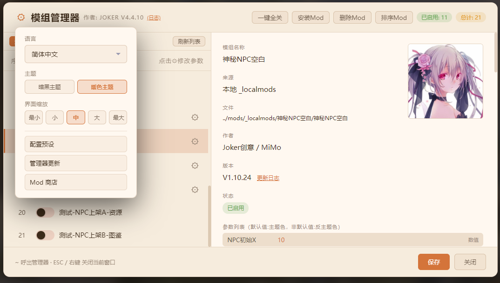
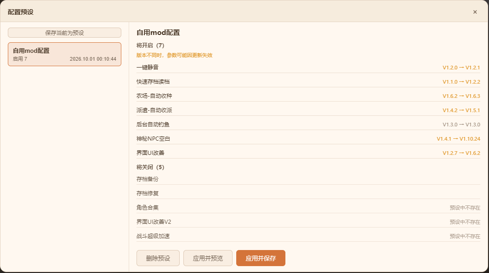
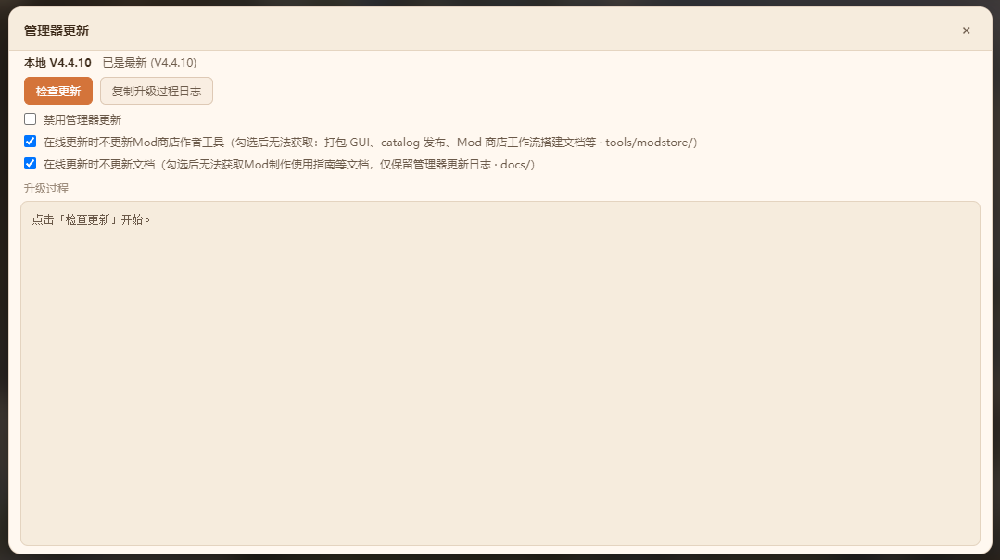
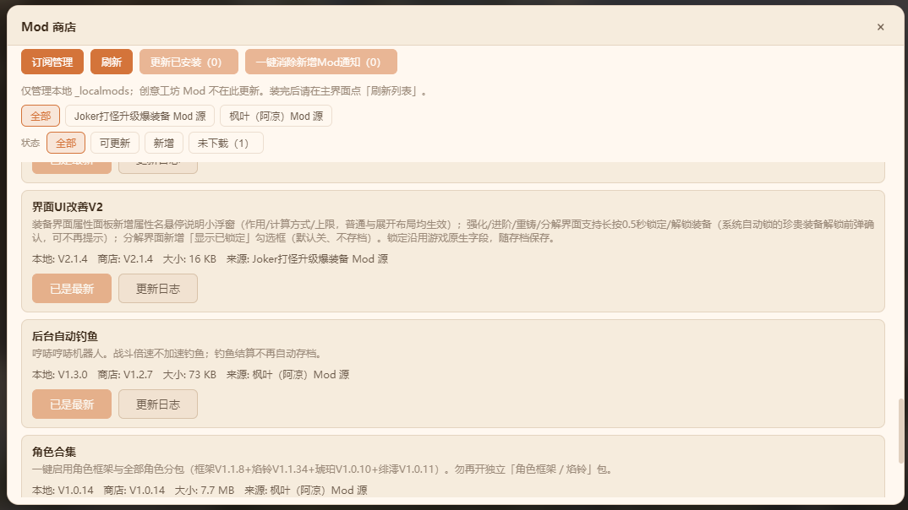
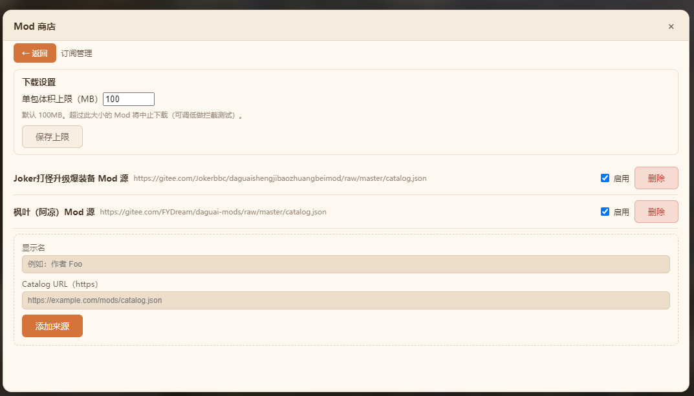
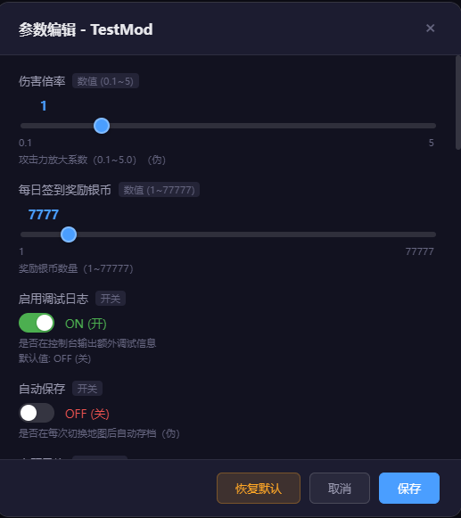
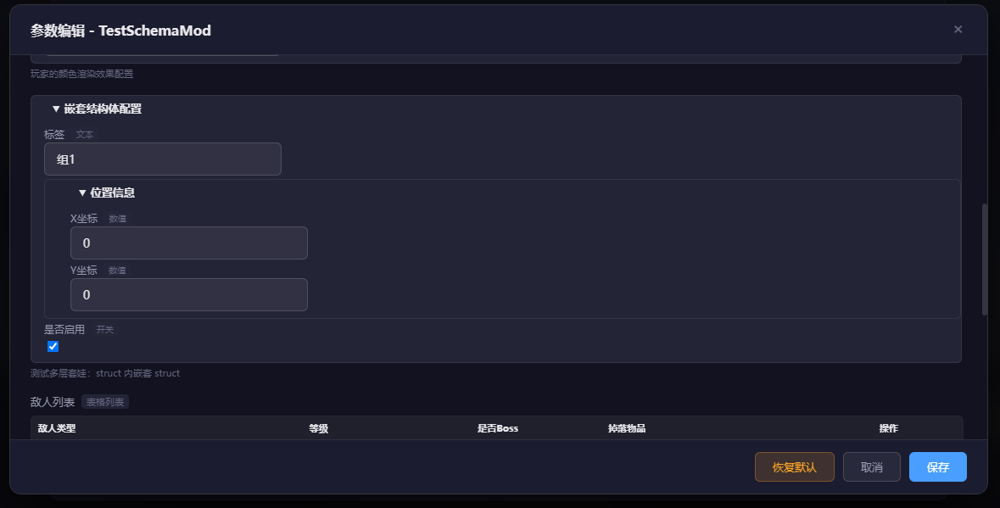
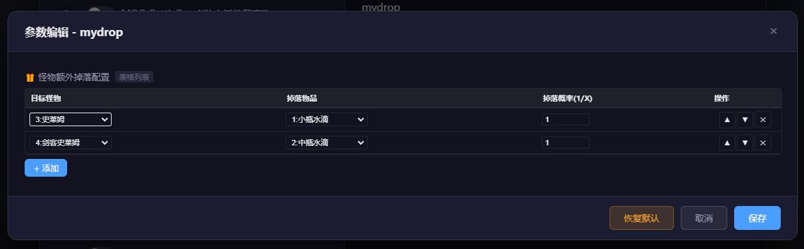
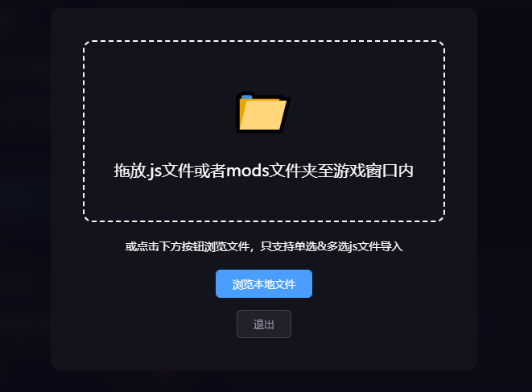
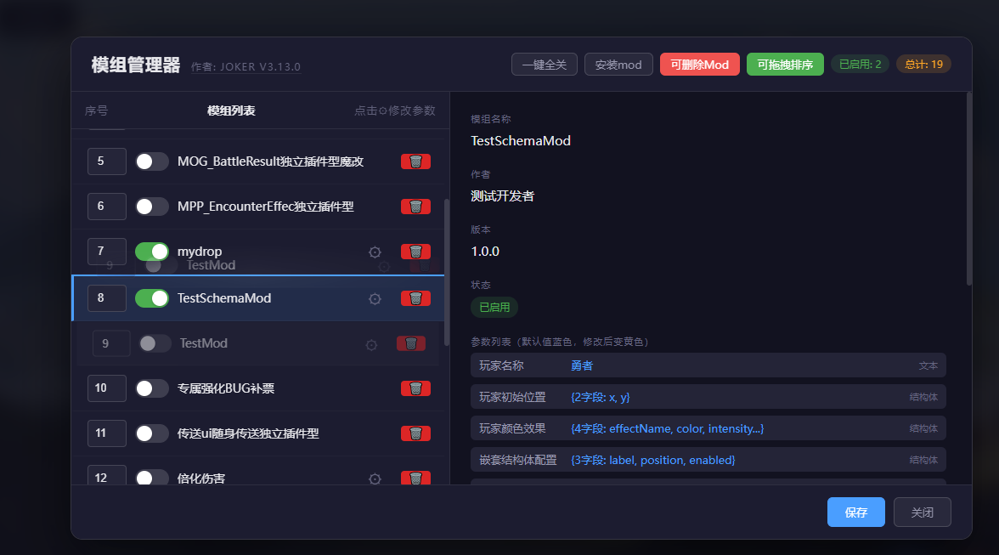

# RMMZ ModLoader

[](https://github.com/jokerBBC/rpg-maker-mz-mod-loader/blob/main/LICENSE)
[](https://github.com/jokerBBC/rpg-maker-mz-mod-loader/releases/latest)
[](https://github.com/jokerBBC/rpg-maker-mz-mod-loader/releases)

> **[中文版 README](README.md)**

In-game mod manager **V4.5.0**

A powerful RPG Maker MZ mod manager that lets you enable/disable, edit parameters, reorder, and check dependencies for **local mods** and **Steam Workshop mods** — all from inside the game. **Multilingual UI** is supported (Simplified Chinese / Traditional Chinese / English).

> **Runtime**: RPG Maker MZ (NW.js)  
> **Mod config**: stored in `mod_config.json`; toggles and parameters survive game updates  
> **Steam Workshop** requires a legitimate Steam install path to resolve Workshop directories  

***

## ✨ Real-world examples

- Guide/wiki for the game *Idle Level Up & Fight Monsters* using RMMZ ModLoader V4.1.2 (includes mod manager tutorial · [Feishu link](https://qcnhq5e2tphh.feishu.cn/wiki/XH1jwdX5uil2ookoEF8cpN1AnJf))
- Fine-tuning examples for *Crimson Moon Immortal Journey* based on RMMZ ModLoader V4 ([Baidu Tieba post 1](https://tieba.baidu.com/p/10810499585?fr=personpage) · [Baidu Tieba post 2](https://tieba.baidu.com/p/10813947286?fr=personpage))
- Mod manager usage demo for *Dark Abyss Rises* (暗源崛起) built on RMMZ ModLoader (Bilibili video · [BV1twYY6dEMv](https://www.bilibili.com/video/BV1twYY6dEMv/?spm_id_from=333.788.videopod.sections&vd_source=3ef6190ccbaf3b82c0dd3ef57cd79cc8&p=7))
- Example Mod store repositories (reference catalog publishing pipelines built with AI assistance; compatibility verified):
  - 打怪升级爆装备 mod store — validated on the legacy V4.4.6 manager kernel · <https://gitee.com/Jokerbbc/daguaishengjibaozhuangbeimod>
  - 暗源崛起 (Dark Abyss Rises) mod store · <https://gitee.com/Jokerbbc/dark-abyss-rises-mod>
  - 挂机升级打怪兽 (*Idle Level Up & Fight Monsters*) mod store · <https://gitee.com/Jokerbbc/guajishengjidaguaishoumod>

***

## ✨ Features

| Feature | Description |
| --- | --- |
| 🎮 **In-game management** | Manage mod toggles, parameters, and load order without external tools |
| 🛒 **Steam Workshop** | Scans `workshop/content/<AppID>/` (AppID configurable); filter, refresh list; unified package layout for local and Workshop mods |
| 🏪 **Mod store extension** | `libs/modStore.js`: multi-source HTTPS catalog subscribe, download/update packages to `_localmods`, resume for large files (>50MB); **multilingual UI** (Simplified / Traditional Chinese, English — follows manager language); list **Changelog** button |
| 🔄 **Manager self-update** | `libs/modLoaderUpdater.js`: manual check/update for ModLoader itself (catalog + raw files); separate from Mod store; disable toggle; green badge additive; optional skip of author tools / docs (manager changelog kept) |
| 💾 **Config presets** | `libs/modConfigPresets.js`: save current mod toggles/params/order as named presets in Settings; preview diffs then apply (preview only or save immediately); files under `config/mod_presets/` |
| 📦 **Unified package layout** | Local `_localmods/<package>/` matches Workshop subscription root layout (V4.1); package-root `CHANGELOG.md` is the only mod changelog location (V4.2) |
| 📋 **Mod changelogs** | Detail panel link next to version; header **(Changelog)** for ModLoader itself; shared Markdown modal for store / detail / manager |
| ⚙️ **Parameter editor** | number, boolean, string, select, color, note, database refs, struct, table |
| 🔀 **Order & dependencies** | Drag/index reordering; `@base` / `@orderAfter` checks; skips loading when `@base` is missing (dependency guard) |
| ⚠️ **Duplicate script basenames** | Warns when a mod collides with a game plugin or another mod; confirm before enabling an ineffective entry (V4.4.2) |
| ⚠️ **Conflict log panel** | Settings gear menu entry + empty shell panel (content from prerequisite mod `render`); red bang beside gear when conflicts exist |
| 📥 **Drag / browse install** | Drop or browse `.js`; drop / browse an entire `mods` folder (local mods only; unified pipeline in V4.4.1) |
| 🖼️ **Preview images** | `preview.png` at package root; thumbnail in details + click for full-size popup |
| 🛡️ **Config compatibility** | V4.1.1 reads legacy V3.x `../mods/` keys; saving once auto-migrates to new keys |
| 🌐 **Multilingual** | Simplified Chinese / Traditional Chinese / English |
| 🎨 **Dual themes** | Dark / warm |

***

## ✨ UI Screenshots (Dark / Warm themes)

<div align="center">

Main screen — Workshop


</div>

<div align="center">

Main screen



</div>

<div align="center">

Config presets



</div>

<div align="center">

Manager update



</div>

<div align="center">

Mod store



</div>

<div align="center">

Mod store — subscription management



</div>

<div align="center">

Parameter editor



</div>

<div align="center">

Parameter editor — nested struct



</div>

<div align="center">

Parameter editor — table



</div>

<div align="center">

Install screen



</div>

<div align="center">

Delete mode & sort mode



</div>

***

## 📥 Installation

### Mode 1: Injection (recommended)

Edit `index.html` and inject ModLoader **before** `main.js`:

```html
<body style="background-color: black">
<script type="text/javascript" src="js/libs/pixi.js"></script>
<script type="text/javascript" src="js/mods/ModLoader.js"></script>
<script type="text/javascript" src="js/main.js"></script>
</body>
```

**Prefer not to hand-edit / one-click restore after game updates**: use the ready-made 「Mod管理器注入工具.bat」 — copy it to the game directory and double-click: **1** inject manager / **2** remove injection (restore vanilla game) / 3 exit. Integration bundles already ship this tool in the game directory; manual installs can copy it from `js/mods/tools/modpack/` in this repo. When a game update overwrites `index.html` and the manager entry disappears, run it and pick 1 to restore. Mod authors: the bundle build script includes it automatically — players never need to hand-edit.

### Mode 2: Plugin mode

Add `ModLoader.js` to the RMMZ Plugin Manager list.

> ⚠️ After changing mod toggles, parameters, or load order, press **F5** to reload the game.  
> ⚠️ Subscribe/unsubscribe Workshop mods in the **Steam client**.

***

## 📁 Project structure (V4.5.0)

```
js/mods/
├── ModLoader.js                    # Entry: boot, UI, orchestration, public API
├── mod_config.json                 # Mod toggles / params / order (runtime)
├── config/
│   ├── modloader.css
│   ├── modloader_config.json       # Manager prefs (language, theme, workshop, …)
│   ├── mod_store.json              # Mod store subscriptions (when modStore.js present)
│   ├── modloader_updater.json      # Self-update prefs (when modLoaderUpdater.js present)
│   ├── mod_presets/                # Config presets (when modConfigPresets.js present)
│   └── language/                   # Manager UI i18n (zh_CN / zh_TW / en)
├── modloader/                      # Pure manager logic (config, scan, install, params, deps, …)
├── _localmods/                     # Local mod packages
│   ├── ModDataLoader/              # Data prerequisite (merge/replace/add)
│   ├── ModResourceLoader/          # Resource prerequisite (replace/add)
│   └── <package>/
│       ├── <script>.js
│       ├── CHANGELOG.md            # optional; mod changelog
│       ├── preview.png             # optional
│       └── modloader.json          # optional (multi-script requires version)
├── _workshop/<fileId>/             # Workshop junction (auto-generated)
├── docs/
│   ├── README.md / README-en.md
│   ├── 使用手册.md
│   ├── modloader_CHANGELOG.md
│   ├── mod商店拓展.md
│   └── img/                        # README screenshots
├── libs/                           # Vendors + optional extensions (present = on, delete = off)
│   ├── marked.min.js               # Markdown rendering
│   ├── modStore.js                 # Mod store
│   ├── modLoaderUpdater.js         # Manager self-update
│   ├── modConfigPresets.js         # Config presets
│   └── piracyGate.js               # Piracy gate
└── tools/                          # Author-facing tools (delivered via online update; players who keep "skip author tools" checked never download them)
    ├── modstore/                   # Mod store publishing workflow (AI-assisted setup)
    │   ├── README.md               #   Publishing workflow guide: whitelist/blacklist, dry-run checks, one-click push
    │   ├── modStorePublishCore.js  #   Core packaging lib: zip + sha256 + catalog entries
    │   ├── modstore-catalog.template.json  # catalog template
    │   └── gui/                    #   Graphical packaging tool (browser UI)
    │       ├── README.md
    │       ├── server.js / start-gui.bat / 启动Mod打包工具.bat
    │       ├── folderDialog.js / gitRemote.js / pick-folder.ps1
    │       └── public/             #   frontend (index.html / app.js / app.css)
    └── modpack/                    # Mod manager bundle build workflow (AI-assisted)
        ├── README.md               #   Build guide: interview checklist → bundle_config → dry-run → build & distribute
        ├── bundle_config.example.json  # Build config template (bundled mods / store sources / output names)
        ├── install_builder.py      #   Installer wizard source (game data externalized; PyInstaller-buildable)
        ├── build_package.py        #   Config-driven packaging script
        ├── gen_inject_bat.py       #   Generates the GBK injection tool
        └── Mod管理器注入工具.bat    #   Generated; inject / remove injection, ships with bundles into the game dir
```

Steam Workshop subscription package (same layout as `_localmods`, scripts at package root):

```
<SteamLibrary>/steamapps/workshop/content/<AppID>/<publishedFileId>/
  modloader.json
  preview.png
  YourMod.js
```

***

## 📖 Developer resources

### Prerequisite mods

ModLoader manages only `.js` plugin toggles, load order, and parameters. **Database and asset replace/add** are provided by separate prerequisite mods. Feature mods declare `@base ModDataLoader` / `@base ModResourceLoader`; when porting to another game, you mainly add or remove **GameAdapter** compatibility layers while keeping the core APIs shared.

| Prerequisite mod | Capabilities |
| --- | --- |
| **ModDataLoader** | Field-level merge, full replace, new entries, map event-level shallow merge; zero-code injection via `modloader.json` `data.records` / `data.patches`; stableKey smart ID migration; conflict reports integrated with ModLoader log panel |
| **ModResourceLoader** | Declarative replace via `modloader.json` `resources`; `loadBitmap(modId, path)` for mod-owned images; modId aliases (stable across local / Workshop package names); optional encryption bypass |

Sample packages: `_localmods/TestMDL-V2` (data), `_localmods/TestMRL-V2` (resources).

**Changelogs**: Like feature mods, ModDataLoader and ModResourceLoader maintain package-root `CHANGELOG.md` (e.g. `_localmods/ModDataLoader/CHANGELOG.md`) for manager detail UI and Mod Store online updates.

| Resource | Description |
| --- | --- |
| [使用手册.md](使用手册.md) | Full guide for game authors / players / mod authors |
| [modloader_CHANGELOG.md](modloader_CHANGELOG.md) | ModLoader changelog |
| [mod商店拓展.md](mod商店拓展.md) | Mod store design & test |
| [tools/modstore/gui/README.md](../tools/modstore/gui/README.md) | Author packaging GUI & catalog publishing |
| [Mod store publishing workflow · AI assistant guide](../tools/modstore/README.md) | AI-assisted Mod store setup: whitelist/blacklist governance, dry-run checks, one-click push |
| [Bundle build guide · AI assistant](../tools/modpack/README.md) | AI-assisted Mod manager bundle creation for any RMMZ game: interview checklist, bundle_config, build & distribute |

***

## 📝 Supported parameter types

| Type | Description | Example |
| --- | --- | --- |
| `number` | Numeric (slider supported) | `@min 0 @max 100 @step 1` |
| `boolean` | Toggle | `@default true` |
| `string` | Text | `@default Hello` |
| `select` | Single-select dropdown | `@option A @option B` |
| `color` | Color | `@default #ff0000` |
| `note` / `multiline_string` | Long text | Multi-line editor |
| `actor` | DB ref · Actor | `@default 1` |
| `class` | DB ref · Class | `@default 1` |
| `skill` | DB ref · Skill | `@default 1` |
| `item` | DB ref · Item | `@default 1` |
| `weapon` | DB ref · Weapon | `@default 1` |
| `armor` | DB ref · Armor | `@default 1` |
| `enemy` | DB ref · Enemy | `@default 1` |
| `troop` | DB ref · Troop | `@default 1` |
| `state` | DB ref · State | `@default 1` |
| `animation` | DB ref · Animation | `@default 1` |
| `common_event` | DB ref · Common Event | `@default 1` |
| `switch` | DB ref · Switch | `@default 1` |
| `variable` | DB ref · Variable | `@default 1` |
| `struct` | Struct | `@schema SchemaName` |
| `table` | Table list | `@schema SchemaName` |

### Common metadata tags

| Tag | Description |
| --- | --- |
| `@text` | Display name in the parameter UI |
| `@base` | Prerequisite dependency |
| `@orderAfter` | Must load after a given plugin |
| `@orderBefore` | Must load before a given plugin |
| `@define-schema` / `@schema` | struct/table template |

See [User manual · Mod authors](使用手册.md#三mod-作者) for full spec and example mods.

### Feature details (struct / @text)

#### 1. `@text` parameter alias

```javascript
@param damageMultiplier
@text 伤害倍率
@type number
@default 2
```

#### 2. Schema templates + struct/table

```javascript
@define-schema MonsterDropSchema
[{"name":"enemyId","text":"目标怪物","type":"enemy","default":"1"}, ...]

@param dropList
@type table
@schema MonsterDropSchema
```

Values require `JSON.parse()` — see `TestSchemaMod.js` and `mydrop.js`.

***

## 📜 License

MIT License — see [LICENSE](LICENSE)

***

**Version**: V4.5.0 | **Updated**: 2026-10-09
