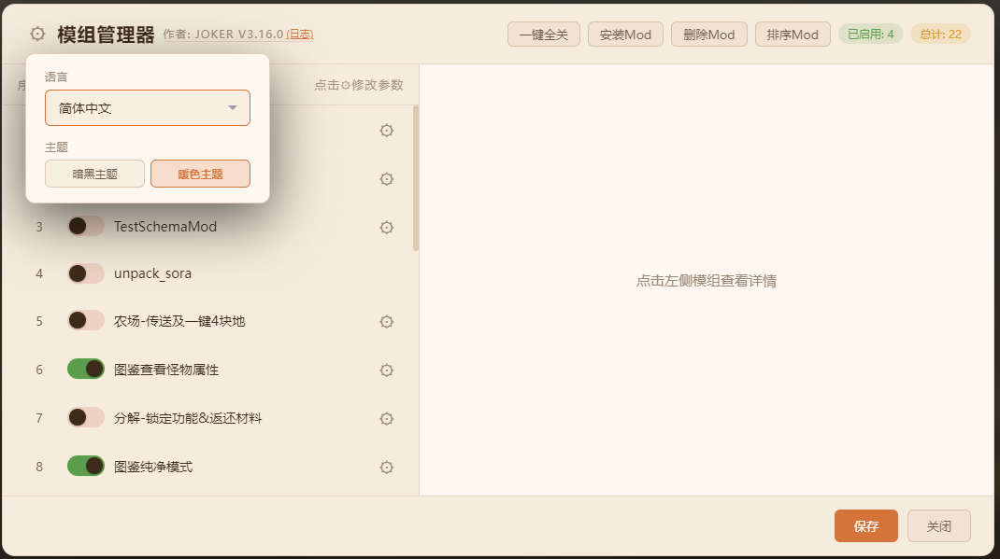
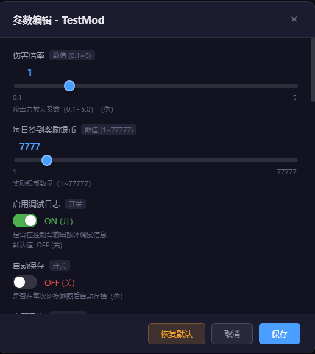
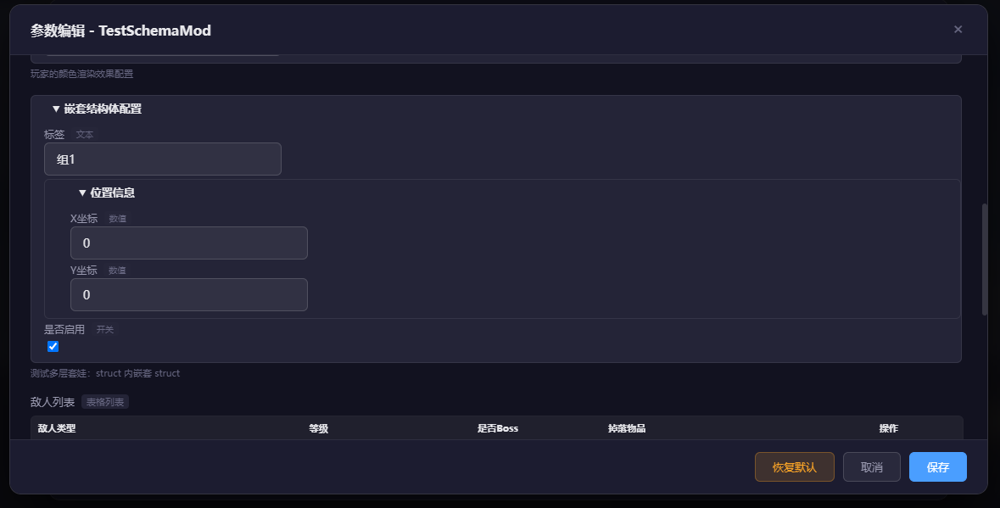
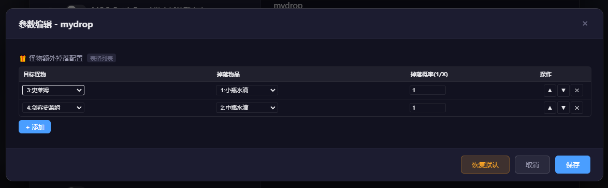
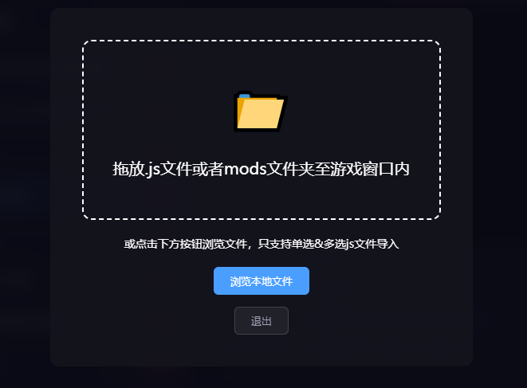
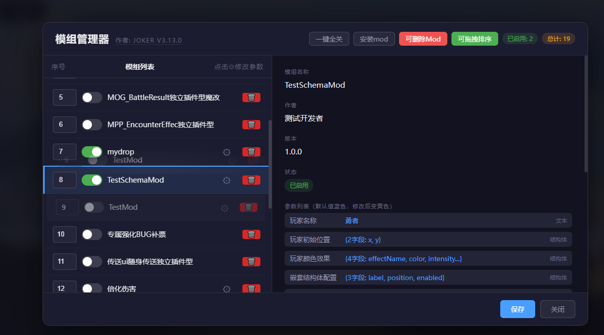

# RMMZ ModLoader

游戏内模组管理器 **V4.1.2**

一款功能强大的 RPG Maker MZ 模组管理器，支持在游戏内管理 **本地 Mod** 与 **Steam 创意工坊 Mod** 的开启/关闭、参数编辑、排序与依赖检测。**现已支持多语言界面**（简体中文 / 繁體中文 / English）。

> **运行环境**：Mod 配置保存在 `mod_config.json`，**不再写入** `plugins.js`，游戏更新官方插件后 Mod 开关与参数不会丢失。**创意工坊**需 Steam 正版安装路径才能解析工坊目录；**盗版环境检测**默认关闭，游戏作者可在 `modloader_config.json` 中按需开启。

***

## ✨ 功能特性

| 功能 | 描述 |
| --- | --- |
| 🎮 **游戏内管理** | 无需额外程序，直接在游戏中管理 Mod 开关、参数与排序 |
| 🛒 **Steam 创意工坊** | 扫描 `workshop/content/<AppID>/`（AppID 可配置）；筛选、刷新；本地与工坊统一包结构 |
| 📦 **统一包结构** | 本地 `_localmods/<包名>/` 与工坊订阅包根目录布局一致（V4.1） |
| ⚙️ **参数编辑** | 数值、开关、文本、单选、颜色、长文本、数据库引用、struct、table |
| 🔀 **排序与依赖** | 拖拽/序号排序；`@base` / `@orderAfter` 依赖检测 |
| 📥 **拖放安装** | 拖放 `.js` 或整个 `mods` 文件夹（仅本地 Mod） |
| 🖼️ **预览图** | 包根 `preview.png`；详情缩略 + 点击弹窗大图 |
| 🛡️ **配置兼容** | V4.1.1 读取 V3.x `../mods/` 旧键；保存一次自动升级为新键 |
| 🌐 **多语言** | 简体中文 / 繁體中文 / English |
| 🎨 **双主题** | 暗黑 / 暖色 |

***

## ✨ UI 截图（暗黑/暖色双主题）

<div align="center">

主界面-创意工坊


</div>

<div align="center">

主界面



</div>

<div align="center">

参数编辑界面



</div>

<div align="center">

参数编辑界面-多层套娃



</div>

<div align="center">

参数编辑界面-表格



</div>

<div align="center">

安装界面



</div>

<div align="center">

删除模式和排序模式



</div>

***

## 使用手册

[使用手册.md](使用手册.md)

***

## 📥 安装方式

### 模式 1：注入模式（推荐）

修改 `index.html`，在 `main.js` 之前注入 ModLoader：

```html
<body style="background-color: black">
<script type="text/javascript" src="js/libs/pixi.js"></script>
<script type="text/javascript" src="js/mods/ModLoader.js"></script>
<script type="text/javascript" src="js/main.js"></script>
</body>
```

### 模式 2：插件模式

在 RMMZ 插件管理器中将 `ModLoader.js` 添加到插件列表。

> ⚠️ 修改 Mod 开关、参数或排序后，需要 **F5 刷新** 才能生效。  
> ⚠️ 创意工坊 Mod 请在 **Steam 客户端** 订阅/取消订阅。

***

## 📁 项目结构（V4.1）

```
js/mods/
├── ModLoader.js
├── mod_config.json
├── config/
│   ├── modloader.css
│   ├── modloader_config.json
│   └── language/
├── _localmods/                     # 本地 Mod 包
│   └── <包名>/
│       ├── <脚本>.js
│       ├── preview.png             # 可选
│       └── modloader.json          # 可选（多脚本）
├── _workshop/<fileId>/             # 工坊 junction（自动生成）
├── docs/
│   ├── README.md                   # 本说明
│   ├── 使用手册.md
│   ├── V4.1_测试文档.md
│   └── modloader_CHANGELOG.md
└── config/ docs/ libs/ tools/ …    # 共享资源，不参与 Mod 扫描
```

Steam 工坊订阅包（与 `_localmods` 同布局，脚本在包根）：

```
<Steam库>/steamapps/workshop/content/<AppID>/<publishedFileId>/
  modloader.json
  preview.png
  YourMod.js
```

***

## 📖 开发资源

| 资源 | 说明 |
| --- | --- |
| [使用手册.md](使用手册.md) | 游戏制作者 / 玩家 / Mod 作者完整指南 |
| [RMMZ_ModLoader_开发规范.md](RMMZ_ModLoader_开发规范.md) | ModLoader 自身开发规范 |
| [V4.1_测试文档.md](V4.1_测试文档.md) | V4.1 功能测试清单 |
| [V4.1_unified_package_plan.md](V4.1_unified_package_plan.md) | V4.1 实施计划 |
| [modloader_CHANGELOG.md](modloader_CHANGELOG.md) | 完整更新日志 |

***

## 📝 支持的参数类型

| 类型 | 说明 | 示例 |
| --- | --- | --- |
| `number` | 数值（支持滑动条） | `@min 0 @max 100 @step 1` |
| `boolean` | 开关 | `@default true` |
| `string` | 文本 | `@default Hello` |
| `select` | 单选下拉 | `@option A @option B` |
| `color` | 颜色 | `@default #ff0000` |
| `note` / `multiline_string` | 长文本 | 多行编辑 |
| `actor/skill/item/...` | 数据库引用 | 下拉选择 |
| `struct` | 结构体 | `@schema SchemaName` |
| `table` | 表格列表 | `@schema SchemaName` |

### 常用元数据标签

| 标签 | 说明 |
| --- | --- |
| `@text` | 参数界面显示名 |
| `@base` | 前置依赖 |
| `@orderAfter` | 应排在某插件之后 |
| `@define-schema` / `@schema` | struct/table 模板 |

详细规范与示例 Mod 见 [使用手册 · Mod 作者](使用手册.md#三mod-作者)。

### 功能详解（struct / @text）

#### 一、`@text` 参数别名

```javascript
@param damageMultiplier
@text 伤害倍率
@type number
@default 2
```

#### 二、Schema 模板 + struct/table

```javascript
@define-schema MonsterDropSchema
[{"name":"enemyId","text":"目标怪物","type":"enemy","default":"1"}, ...]

@param dropList
@type table
@schema MonsterDropSchema
```

读取时需 `JSON.parse()`，可参考 `TestSchemaMod.js`、`mydrop.js`。

***

## 📜 开源协议

MIT License — 详见 [LICENSE](LICENSE)

***

**版本**: V4.1.2 | **更新日期**: 2026-06-25
